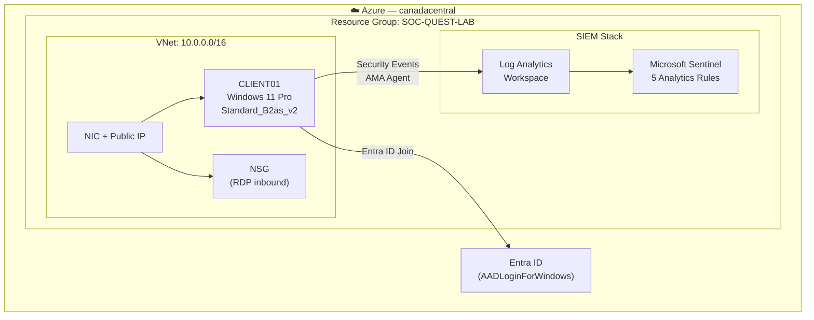

# Aymerick Victoire — Security Engineer

> Azure Security | Microsoft Sentinel | KQL | Terraform | Entra ID

[](https://github.com/AymerickVic/soc-quest/actions/workflows/terraform-validate.yml)
[](https://learn.microsoft.com/en-us/certifications/exams/az-500)
[](https://learn.microsoft.com/en-us/certifications/exams/sc-200)
[](https://www.comptia.org/certifications/a)
[](https://www.terraform.io/)

---

## About

Sys & network admin with 3+ years experience managing 114 workstations across 4 sites (GLPI, Intune, Entra ID).  
Transitioning to **Security Engineer** — specializing in Azure cloud security, infrastructure hardening, and detection engineering.

**Target:** Security Engineer in Montreal (PVT 2026)  
**Stack:** Azure Security · Microsoft Sentinel · Defender XDR · KQL · Terraform · PowerShell · Entra ID

---

## Lab Architecture



---

## Repository Structure

```
soc-quest/
├── .github/
│   ├── workflows/terraform-validate.yml  ← CI: fmt + validate + tflint
│   ├── SECURITY.md
│   └── CONTRIBUTING.md
├── terraform/              ← Azure lab infrastructure as code
├── kql/                    ← Detection & threat hunting queries (11 queries)
│   ├── authentication/     ← Brute force, password spray, impossible travel
│   ├── persistence/        ← New admin accounts, scheduled tasks
│   ├── lateral-movement/   ← Pass-the-hash, WMI
│   ├── exfiltration/       ← DNS tunneling
│   └── threat-hunting/     ← Kerberoasting, LSASS, LOtL binaries
├── powershell/             ← Administration & security scripts
├── sentinel-lab/           ← Sentinel deployment, analytics rules as JSON
└── incident-writeups/      ← Documented investigations (2 write-ups)
```

---

## Azure Security Lab

Home lab running on Azure — fully reproducible via Terraform.

| Component | Status |
|---|---|
| Entra ID | ✅ Users, groups, RBAC configured |
| Microsoft Sentinel | ✅ 5 analytics rules + 4 data connectors |
| Defender XDR | ✅ Unified security portal |
| CLIENT01 (Win11 Pro) | ✅ Entra ID joined |
| Infrastructure as Code | ✅ Full lab deployable in ~5 min |
| Analytics Rules as Code | ✅ JSON-deployable Sentinel rules |

**Rebuild the entire lab from scratch:**
```bash
git clone https://github.com/AymerickVic/soc-quest
cd soc-quest/terraform
terraform init
terraform apply -var="admin_password=<your-password>"
```

---

## KQL Detection Coverage

| MITRE Tactic | Technique | File |
|---|---|---|
| Credential Access | T1110 — Brute Force | `authentication/brute-force-detection.kql` |
| Credential Access | T1110.003 — Password Spray | `authentication/password-spray.kql` |
| Initial Access | T1078 — Impossible Travel | `authentication/impossible-travel.kql` |
| Persistence | T1136.001 — New Admin Account | `persistence/new-admin-account.kql` |
| Persistence | T1053.005 — Scheduled Task | `persistence/scheduled-task-creation.kql` |
| Lateral Movement | T1550.002 — Pass-the-Hash | `lateral-movement/pass-the-hash.kql` |
| Lateral Movement | T1047 — WMI | `lateral-movement/wmi-lateral-movement.kql` |
| Exfiltration | T1048.003 — DNS Tunneling | `exfiltration/dns-tunneling.kql` |
| Multiple | T1558.003 — Kerberoasting | `threat-hunting/kerberoasting.kql` |
| Credential Access | T1003.001 — LSASS Dump | `threat-hunting/lsass-dump.kql` |
| Defense Evasion | T1218 — LOtL Binaries | `threat-hunting/living-off-the-land.kql` |

---

## Certifications

| Certification | Relevance | Status |
|---|---|---|
| CompTIA A+ (220-1201/1202) | IT foundations | 🔄 In progress |
| CompTIA Network+ | Network foundations | ⏳ Planned |
| CompTIA Security+ | Security baseline | ⏳ Planned |
| AZ-104 — Azure Administrator | Azure prerequisite | ⏳ Planned |
| **AZ-500 — Azure Security Engineer** ⭐ | **Core cert** | ⏳ Planned |
| SC-200 — Security Operations Analyst | Sentinel + Defender XDR | ⏳ Planned |
| HashiCorp Terraform Associate | IaC / DevSecOps | ⏳ Planned |

---

## Contact

- **LinkedIn:** [Aymerick Victoire](https://linkedin.com/in/aymerick-victoire-41796820a)
- **Email:** victoireaymerick@gmail.com
- **Location:** Martinique → Montreal 2026
